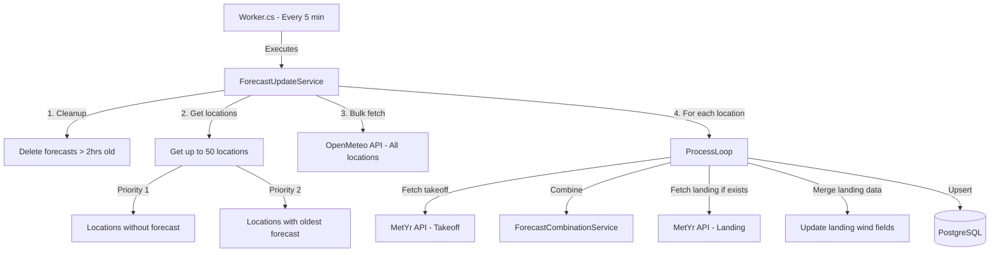

# Forecast Update Service Flow

This diagram shows the flow of the forecast update service that runs every 5 minutes.

## Process Details

1. **Cleanup**: Deletes forecast data older than 2 hours
2. **Location Selection**:
   - Priority 1: Locations without any forecast data
   - Priority 2: Locations with the oldest forecast data
   - Batch size: 50 locations per cycle
3. **Bulk Fetch**: Fetches OpenMeteo data for all 50 locations in a single API call
4. **Per-Location Processing**:
   - Fetch MetYr data for takeoff location
   - Combine OpenMeteo and MetYr data
   - If landing coordinates exist, fetch MetYr data for landing location
   - Merge landing wind data into combined forecasts
   - Upsert all forecast records to database
