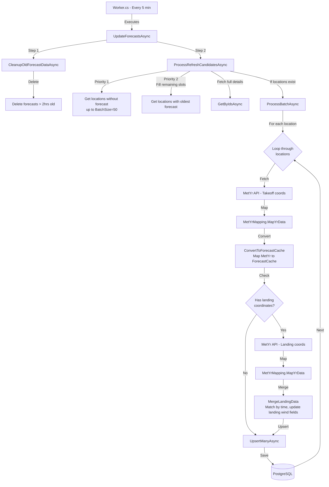

# Forecast Update Service Flow

This diagram shows the flow of the forecast update service that runs every 5 minutes (cron: `0 1/5 * * * *`).

## Process Details

### 1. Cleanup (CleanupOldForecastDataAsync)

- Deletes all forecast data older than 2 hours from current UTC time
- Runs via `ForecastCacheService.DeleteOldForecastsAsync()`

### 2. Location Selection (ProcessRefreshCandidatesAsync)

- **Priority 1**: Inline repository query gets active main locations without any forecast data (up to BatchSize=50)
- **Priority 2**: Inline repository query fills remaining slots with active main locations having the oldest forecast update time
- Fetches full `ParaglidingLocation` details for all selected location IDs
- Batch size: 50 locations per cycle

### 3. Batch Processing (ProcessBatchAsync)

- Processes locations sequentially (one at a time)
- Each location makes individual API calls to MetYr

### 4. Per-Location Processing Loop

For each location in the batch (sequentially):

1. **Fetch & Map MetYr Takeoff Data**

   - Calls MetYr API with takeoff latitude/longitude
   - Maps response via `MetYrMapping.MapYrData()`

2. **Convert to ForecastCache**

   - Converts MetYr data directly to `ForecastCache` records via `ConvertToForecastCache()`
   - Sets location ID and timestamps
   - Populates surface conditions from MetYr data
   - Sets atmospheric pressure-level fields to null (not provided by MetYr)
   - Determines `IsDay` from MetYr `SymbolCode` (0 if contains "night", 1 otherwise)
   - Sets `IsYrData` to true

3. **Optional Landing Data** (if `LandingLatitude` and `LandingLongitude` exist)

   - Calls MetYr API with landing coordinates
   - Maps response via `MetYrMapping.MapYrData()`
   - Merges landing wind data via `MergeLandingData()`:
     - Matches forecast records by time (formatted as `yyyy-MM-ddTHH:mm`)
     - Updates `LandingWind`, `LandingGust`, and `LandingWindDirection` fields

4. **Persist to Database**
   - Upserts all forecast records for the location via `ForecastCacheService.UpsertManyAsync()`
   - Continues to next location even if current location fails (error logged but not thrown)

## Data Source

- **MetYr API Only**: All forecast data is fetched exclusively from Met.no's MetYr LocationForecast API
- **Fields Populated**: Surface conditions (temperature, wind, precipitation, pressure, weather code, etc.)
- **Fields Set to Null**: Atmospheric pressure-level data (wind/temperature at 1000/925/850/700hPa, geopotential heights, CAPE, cloud cover levels, stability indices)
