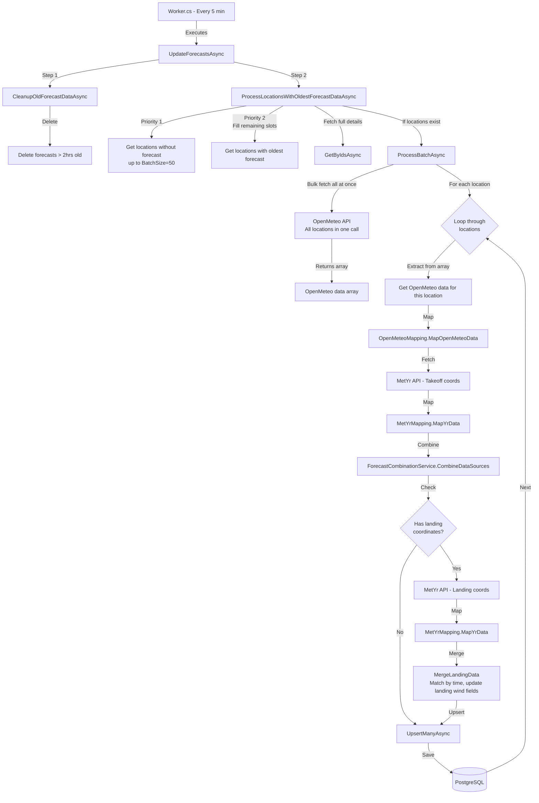

# Forecast Update Service Flow

This diagram shows the flow of the forecast update service that runs every 5 minutes (cron: `0 1/5 * * * *`).

## Process Details

### 1. Cleanup (CleanupOldForecastDataAsync)

- Deletes all forecast data older than 2 hours from current UTC time
- Runs via `ForecastCacheService.DeleteOldForecastsAsync()`

### 2. Location Selection (ProcessLocationsWithOldestForecastDataAsync)

- **Priority 1**: Gets locations without any forecast data (up to BatchSize=50)
- **Priority 2**: Fills remaining slots with locations having the oldest forecast data
- Fetches full `ParaglidingLocation` details for all selected location IDs
- Batch size: 50 locations per cycle

### 3. Batch Processing (ProcessBatchAsync)

- **Single Bulk API Call**: Fetches OpenMeteo data for all locations at once using arrays of latitudes/longitudes
- Returns an array of raw meteo data indexed by location

### 4. Per-Location Processing Loop

For each location in the batch (sequentially):

1. **Extract & Map OpenMeteo Data**

   - Gets the OpenMeteo data for this specific location from the bulk result array
   - Maps raw data to domain model via `OpenMeteoMapping.MapOpenMeteoData()`

2. **Fetch & Map MetYr Takeoff Data**

   - Calls MetYr API with takeoff latitude/longitude
   - Maps response via `MetYrMapping.MapYrData()`

3. **Combine Data Sources**

   - Merges OpenMeteo and MetYr takeoff data using `ForecastCombinationService.CombineDataSources()`
   - Creates initial `ForecastCache` records with location ID

4. **Optional Landing Data** (if `LandingLatitude` and `LandingLongitude` exist)

   - Calls MetYr API with landing coordinates
   - Maps response via `MetYrMapping.MapYrData()`
   - Merges landing wind data via `MergeLandingData()`:
     - Matches forecast records by time (formatted as `yyyy-MM-ddTHH:mm`)
     - Updates `LandingWind`, `LandingGust`, and `LandingWindDirection` fields

5. **Persist to Database**
   - Upserts all forecast records for the location via `ForecastCacheService.UpsertManyAsync()`
   - Continues to next location even if current location fails (error logged but not thrown)
