# Holfuy Sync Service Flow

This diagram shows the flow of the Holfuy sync service that runs on a regular schedule to fetch weather station data from the Holfuy API.

```mermaid
flowchart TB
    Worker[Worker.cs] -->|Scheduled| SyncHolfuy[SyncHolfuyDataAsync]

    SyncHolfuy -->|Step 1| FetchAPI[Holfuy API<br/>FetchHolfuyDataAsync]
    FetchAPI -->|Returns| HolfuyData[HolfuyData Object<br/>WeatherStations + StationData]

    HolfuyData -->|Step 2| CheckStations{Has weather<br/>stations?}
    CheckStations -->|No| LogNoStations[Log warning<br/>No weather stations]
    CheckStations -->|Yes| UpsertStations[UpsertManyAsync<br/>WeatherStationService]

    UpsertStations -->|Save to DB| StationDB[(PostgreSQL<br/>WeatherStation)]
    StationDB -->|Log count| LogStations[Log upserted count]

    LogStations -->|Step 3| CheckData{Has station<br/>data?}
    LogNoStations -->|Step 3| CheckData

    CheckData -->|No| LogNoData[Log warning<br/>No station data]
    CheckData -->|Yes| UpsertData[UpsertManyAsync<br/>StationDataService]

    UpsertData -->|Save to DB| DataDB[(PostgreSQL<br/>StationData)]
    DataDB -->|Returns count| InsertCount[stationDataInserted count]

    InsertCount -->|Log results| LogDataResults[Log inserted/attempted ratio]

    LogDataResults -->|Step 4| ConvertLatest[ConvertFromStationData<br/>LatestStationDataService]
    ConvertLatest -->|Convert array| LatestArray[latestStationDataArray]

    LatestArray -->|Check| HasLatest{Has latest<br/>data?}
    HasLatest -->|No| Complete[Complete sync]
    HasLatest -->|Yes| UpsertLatest[UpsertManyAsync<br/>LatestStationDataService]

    UpsertLatest -->|Save to DB| LatestDB[(PostgreSQL<br/>LatestStationData)]
    LatestDB -->|Log count| LogLatest[Log upserted count]

    LogNoData --> Complete
    LogLatest --> Complete
    Complete -->|Return| ReturnCount[Return stationDataInserted]

    SyncHolfuy -->|Error| LogError[Log error<br/>Throw exception]

```



## Service Overview

The `HolfuySyncService` manages weather data synchronization from the Holfuy API. Unlike MetFrost which fetches data from multiple weather stations in batches, Holfuy provides all station data in a single API call.

## Process Details

### Sync Flow (SyncHolfuyDataAsync)

**Purpose**: Fetch and store all weather station metadata and current observations from Holfuy

**Flow**:

1. **Fetch All Data**: Single API call to `HolfuyClient.FetchHolfuyDataAsync()`

   - Returns `HolfuyData` object containing:
     - `WeatherStations`: List of station metadata
     - `StationData`: List of current observations for all stations

2. **Upsert Weather Stations** (Step 2)

   - Processes station metadata first to ensure foreign key relationships exist
   - Important: Must be done before upserting station data in case Holfuy added new stations
   - Uses `WeatherStationService.UpsertManyAsync()` to insert new or update existing stations
   - Logs count of processed stations (note: count includes updates with no actual changes)

3. **Upsert Station Data** (Step 3)

   - Processes current weather observations for all stations
   - Uses `StationDataService.UpsertManyAsync()` to insert new records
   - Returns count of **newly inserted** records (duplicates are not re-inserted)
   - Logs the ratio of inserted vs. attempted records

4. **Update Latest Station Data** (Step 4)
   - Converts `StationData` records to `LatestStationData` format
   - Uses static method `LatestStationDataService.ConvertFromStationData()`
   - Upserts to `LatestStationData` table (maintains current snapshot for quick access)
   - Logs count of upserted records

**Return Value**: Count of newly inserted `StationData` records

**Error Handling**:

- Catches all exceptions at the top level
- Logs detailed error information
- Re-throws exception (critical operation should halt on failure)

## Key Design Decisions

### 1. Station-First Ordering

Weather stations are upserted **before** station data to handle the case where Holfuy adds a new station. This ensures the foreign key relationship is satisfied when inserting station data.

### 2. Single API Call

Unlike MetFrost which requires batching, Holfuy's API returns all data in one call, simplifying the sync logic.

### 3. Dual Data Storage

- **StationData**: Historical time-series records (append-only)
- **LatestStationData**: Current snapshot for each station (upsert/overwrite)

This dual approach optimizes for both:

- Historical analysis (full time-series in `StationData`)
- Real-time display (quick access via `LatestStationData`)

### 4. Graceful Degradation

The service logs warnings but continues processing if either weather stations or station data are missing, rather than failing completely.

## Data Flow

```
Holfuy API
    ↓
HolfuyClient (Fetch & deserialize)
    ↓
HolfuyMapping (Transform to domain models)
    ↓
HolfuySyncService (Business logic & orchestration)
    ↓
Service Layer (WeatherStationService, StationDataService, LatestStationDataService)
    ↓
Repository Layer (Data persistence)
    ↓
PostgreSQL Database
    ├── WeatherStation (metadata)
    ├── StationData (historical observations)
    └── LatestStationData (current snapshot)
```

## Integration Points

### Dependencies

- **IHolfuyClient**: Fetches data from Holfuy API
- **IWeatherStationService**: Manages weather station metadata
- **IStationDataService**: Manages historical station observations
- **ILatestStationDataService**: Manages current station snapshot
- **ILogger**: Structured logging

### Database Tables

- **WeatherStation**: Station metadata and source identifier
- **StationData**: Time-series weather observations
- **LatestStationData**: Most recent observation for each station

## Scheduling in Worker.cs

The Holfuy sync service schedule should be configured in `Worker.cs` using the `CronScheduler`. Typical scheduling considerations:

- **Frequency**: Depends on how often Holfuy updates their data (typically every 5-15 minutes)
- **Timing**: Should be offset from MetFrost syncs to avoid database contention
- **Error Recovery**: Failed syncs will retry on the next scheduled run

Example scheduling patterns:

- Every 10 minutes: `0 */10 * * * *`
- Every 15 minutes at :05:00: `0 5/15 * * * *`
- Every 5 minutes at :03:00: `0 3/5 * * * *`

## Comparison with MetFrost

| Aspect            | Holfuy                   | MetFrost                        |
| ----------------- | ------------------------ | ------------------------------- |
| API Calls         | Single call for all data | Batched (100 stations per call) |
| Complexity        | Simple, linear flow      | Complex, batch processing       |
| Error Handling    | Fail fast (throws)       | Continue on batch errors        |
| Station Discovery | Every sync               | Separate weekly job             |
| Active Status     | Not managed              | Managed with weekly sync        |
