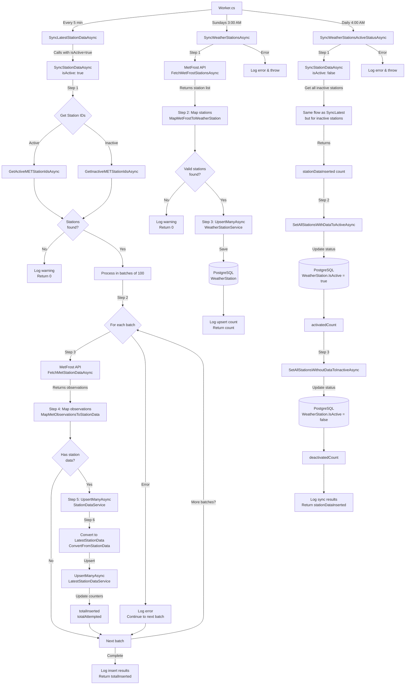

# MetFrost Sync Service Flow

This diagram shows the flow of the MetFrost sync service with three scheduled jobs:

- **Station Data Sync**: Every 5 minutes (cron: `0 2/5 * * * *`) - Duration: ~35s
- **New Stations Sync**: Sundays at 3:00 AM (cron: `0 0 3 * * SUN`) - Duration: ~2s
- **Active Status Sync**: Sundays at 4:00 AM (cron: `0 0 4 * * SUN`) - Duration: ~2s



## Service Overview

The `MetFrostSyncService` manages weather data synchronization from the Norwegian Meteorological Institute's Frost API. It handles three main responsibilities:

1. **Active Station Data Sync** - Regular updates from active weather stations
2. **Weather Station Discovery** - Weekly sync of station metadata
3. **Station Status Management** - Weekly check to activate/deactivate stations based on data availability

## Process Details

### 1. Station Data Sync (SyncLatestStationDataAsync)

**Frequency**: Every 5 minutes at :02:00 seconds  
**Purpose**: Fetch latest weather observations from active MET stations

**Flow**:

1. **Fetch Active Station IDs**: Gets all MET station IDs marked as active from database
2. **Batch Processing**: Splits stations into batches of 100 (MetFrost API limit)
3. **API Call**: Fetches observations from MetFrost API for each batch
4. **Map Data**: Converts MET observations to `StationData` domain models
5. **Upsert Station Data**: Saves to `StationData` table (historical records)
6. **Update Latest Data**: Converts and upserts to `LatestStationData` table (current snapshot)

**Error Handling**:

- Logs errors per batch but continues processing remaining batches
- Returns total count of successfully inserted records

**Key Constants**:

- `MaxStationsPerRequest = 100`: MetFrost API limit for stations per request

### 2. Weather Stations Sync (SyncWeatherStationsAsync)

**Frequency**: Sundays at 3:00 AM  
**Purpose**: Discover new weather stations and update existing station metadata

**Flow**:

1. **Fetch All Stations**: Calls MetFrost API to get complete station list
2. **Map to Domain**: Converts MetFrost station format to `WeatherStation` entities
3. **Upsert**: Updates existing stations and inserts new ones

**Error Handling**:

- Throws exception on failure (critical operation)
- Logs detailed error information

**Note**: This is an upsert operation, so the count returned represents all processed stations, not just new ones.

### 3. Station Active Status Sync (SyncWeatherStationsActiveStatusAsync)

**Frequency**: Sundays at 4:00 AM  
**Purpose**: Automatically activate/deactivate stations based on data availability

**Flow**:

1. **Sync Inactive Stations**: Attempts to fetch data for all inactive stations using `SyncStationDataAsync(isActive: false)`
   - Uses same batching logic as active station sync
   - Checks if previously inactive stations now have data
2. **Activate Stations**: Marks stations as active if they have data in `StationData` table
3. **Deactivate Stations**: Marks stations as inactive if they have no data

**Why This Matters**:

- Automatically discovers when inactive stations come back online
- Removes dead stations from regular polling to improve efficiency
- Runs weekly to balance discovery with API usage

**Error Handling**:

- Throws exception on failure (critical status update)
- Logs detailed statistics: inserted records, activated count, deactivated count

## Data Flow

```
MetFrost API
    ↓
MetFrostClient (Fetch & deserialize)
    ↓
MetFrostMapping (Transform to domain models)
    ↓
Service Layer (Business logic)
    ↓
Repository Layer (Data persistence)
    ↓
PostgreSQL Database
    ├── WeatherStation (metadata & active status)
    ├── StationData (historical observations)
    └── LatestStationData (current snapshot)
```

## Scheduling in Worker.cs

The three MetFrost operations are scheduled with staggered timing to avoid conflicts:

| Job                                  | Cron Expression | Description           | Duration |
| ------------------------------------ | --------------- | --------------------- | -------- |
| SyncLatestStationDataAsync           | `0 2/5 * * * *` | Every 5 min at :02:00 | ~35s     |
| SyncWeatherStationsAsync             | `0 0 3 * * SUN` | Sundays at 3:00 AM    | ~2s      |
| SyncWeatherStationsActiveStatusAsync | `0 0 4 * * *`   | Daily at 4:00 AM      | ~2s      |

**Why the timing?**

- Station data runs every 5 minutes (offset by 1 minute from forecast updates to avoid collision)
- Station discovery runs weekly (metadata doesn't change frequently)
- Status sync runs after station discovery to ensure latest station list is available
